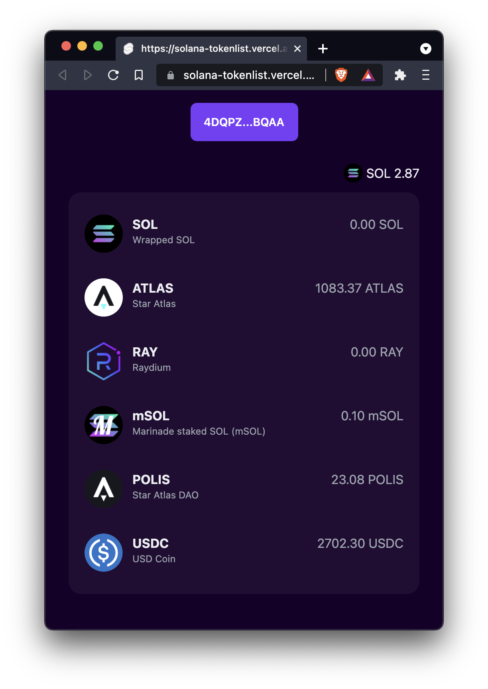

# Solana Wallet for SvelteKit

Basic project with `SvelteKit` for `Solana`. View your wallet balance and SPL token balances.



## Installation

It's easy, dingus!

``` bash
git clone --depth=1 https://github.com/monomadic/solana-tokenlist.git
yarn
yarn dev
```

You'll need [Phantom](https://phantom.app/) wallet.
